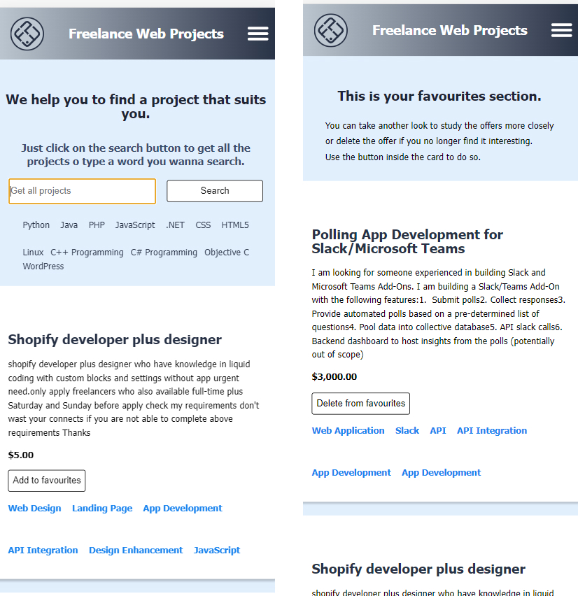
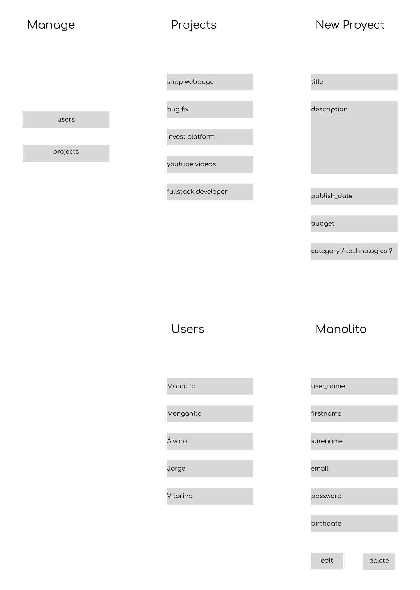
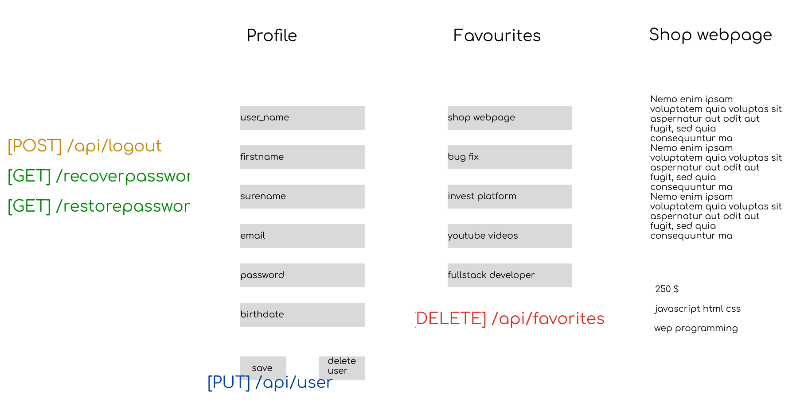
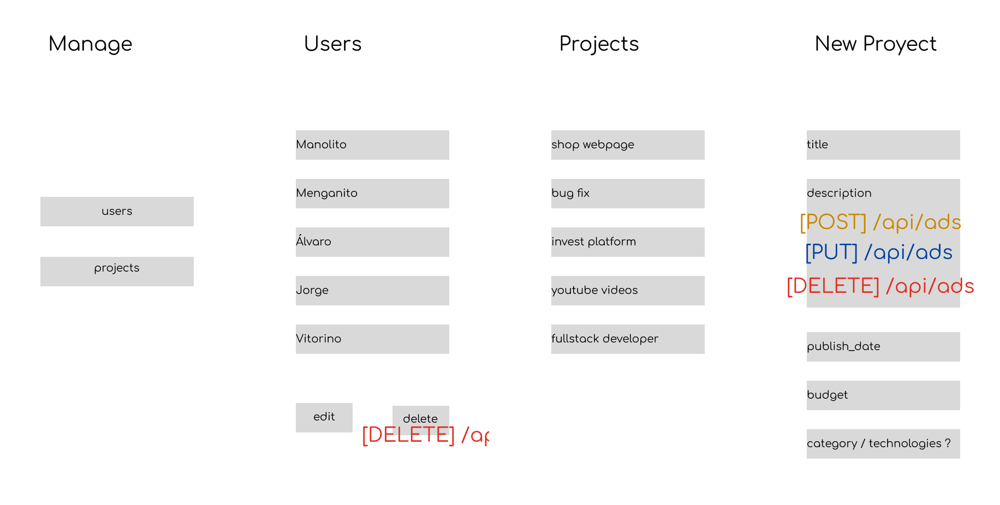
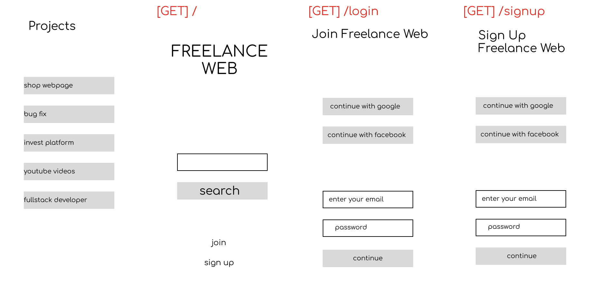
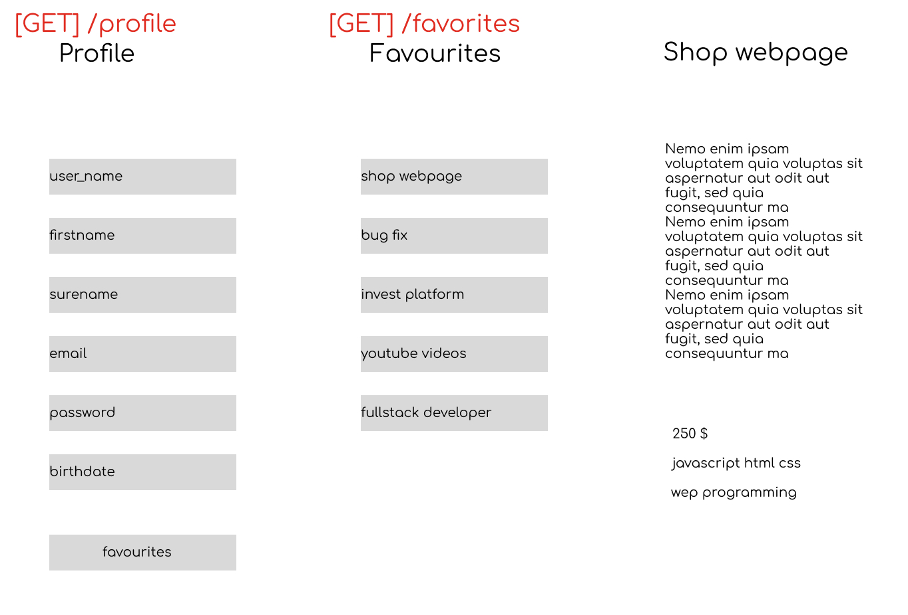

# Freelance Web Page

Aplicación web de búsqueda y gestión de proyectos freelance en todo el mundo. Trabajaremos sobre los conceptos vistos de Frontend y Backend en clase.

## Table of contents

- [Overview](#overview)
  - [The challenge](#the-challenge)
  - [Screenshot](#screenshot)
  - [Links](#links)
- [My process](#my-process)
  - [Built with](#built-with)
  - [What I learned](#what-i-learned)
  - [Continued development](#continued-development)
  - [Useful resources](#useful-resources)
- [Author](#author)
- [Acknowledgments](#acknowledgments)

**Note: Delete this note and update the table of contents based on what sections you keep.**

## Overview

### Objetivo

La app tendrá dos roles distintos: Usuario y Administrador. Las funcionalidades que aparecerán tanto en el panel de control como en el resto de endpoints variarán dependiendo del tipo de usuario, no pudiendo nunca acceder a aquellas zonas o contenidos que no le corresponden.

Como usuario no registrado se podrá:

- Registrarse en la aplicación
- Realizar todas las búsquedas posibles:
  - Mostrar todos los resultados que se tengan del scrapping.
  - Filtrar la búsqueda por palabra clave
  - Filtrar la busqueda por tecnologías (skill) implicadas en los proyectos

Como usuario registrado (User) se podrá:

- Loguearse en la aplicación.
- Realizar todas las búsquedas posibles:
  - Mostrar todos los resultados que se tengan del scrapping:
  - Filtrar la búsqueda por palabra clave.
  - Filtrar la busqueda por tecnologías (skill) implicadas en los proyectos.
- Guardar como favorita cualquier búsqueda, para consultarla más tarde. (/favs).
- Visualizar y editar sus datos de usuario (/profile).
- Cerrar sesión (Logout)
- Recuperar password.
- Cambiar password.

Como Admin registrado se podrá:

- Loguearse en la aplicación.
- Realizar todas las búsquedas posibles.
  - Mostrar todos los resultados que se tengan del scrapping:
  - Filtrar la búsqueda por palabra clave.
  - Filtrar la busqueda por tecnologías (skill) implicadas en los proyectos.
- Gestionar los proyectos (/dashboard):
  - Añadir proyectos.
  - Editar proyectos.
  - Eliminar proyectos.
- Gestionar Usuarios (/dashboard):
  - Añadir usuarios.
  - Editar usuarios.
  - Eliminar usuarios.
- Cerrar sesión (Logout).
- Recuperar password.
- Cambiar password.


### Screenshot





### Links

- Solution URL: [Add solution URL here](https://your-solution-url.com)
- Live Site URL: [Add live site URL here](https://your-live-site-url.com)
- Live Site URL: [Add live site URL here](./docs/index.html)

## My process

### Built with

- Semantic HTML5 markup
- CSS custom properties
- Flexbox
- Mobile-first workflow
- Javascript
- Node
- Express
- Postgres: PgAdmin
- MongoDB: 
- 
- [React](https://reactjs.org/) - JS library
- [Next.js](https://nextjs.org/) - React framework
- [Styled Components](https://styled-components.com/) - For styles











### What I learned

Hemos aumentado nuestra experiencia en diversos campos, entre ellos:
- Gestionar proyectos de envergadura media.
- Trabajo en Grupo.
- Priorización de tareas.
- Uso de Git.
- Uso de Trello.
- Conexión de elementos de la base de datos
- Express
- Scrapping
- Autenthicacion
- JsDocs
- Recuperación de Contraseñas

Use this section to recap over some of your major learnings while working through this project. Writing these out and providing code samples of areas you want to highlight is a great way to reinforce your own knowledge.

To see how you can add code snippets, see below:

```html
<h1>Some HTML code I'm proud of</h1>
```
```css
.proud-of-this-css {
  color: papayawhip;
}
```
```js
const proudOfThisFunc = () => {
  console.log('🎉')
}
```

If you want more help with writing markdown, we'd recommend checking out [The Markdown Guide](https://www.markdownguide.org/) to learn more.

**Note: Delete this note and the content within this section and replace with your own learnings.**

### Continued development

Use this section to outline areas that you want to continue focusing on in future projects. These could be concepts you're still not completely comfortable with or techniques you found useful that you want to refine and perfect.

**Note: Delete this note and the content within this section and replace with your own plans for continued development.**

### Useful resources

- [Example resource 1](https://www.example.com) - This helped me for XYZ reason. I really liked this pattern and will use it going forward.
- [Example resource 2](https://www.example.com) - This is an amazing article which helped me finally understand XYZ. I'd recommend it to anyone still learning this concept.

**Note: Delete this note and replace the list above with resources that helped you during the challenge. These could come in handy for anyone viewing your solution or for yourself when you look back on this project in the future.**

## Author

- Website - [Add your name here](https://www.your-site.com)
- Frontend Mentor - [@yourusername](https://www.frontendmentor.io/profile/yourusername)
- Twitter - [@yourusername](https://www.twitter.com/yourusername)

**Note: Delete this note and add/remove/edit lines above based on what links you'd like to share.**

## Acknowledgments

Agradecemos al profesor, T.A.'s y compañeros por la ayuda en todos los sentidos.
Y también a cualquier persona de nuestro entorno que nos haya hecho más llevaderos los días de proyecto.

**Note: Delete this note and edit this section's content as necessary. If you completed this challenge by yourself, feel free to delete this section entirely.**
