# Freelance Web Page

Aplicación web de búsqueda y gestión de proyectos freelance en todo el mundo. Trabajaremos sobre los conceptos vistos de Frontend y Backend en clase.

## Table of contents

- [Resumen](#resumen)
  - [Objetivo](#objetivo)
  - [Screenshot](#screenshot)
  - [Links](#links)
- [Proceso](#proceso)
  - [Construido con](#construido-con)
  - [Aprendido](#aprendido)
  - [Trabajo pendiente](#trabajo-pendiente)
  - [Useful resources](#useful-resources)

## Resumen

### Objetivo

La app tendrá dos roles distintos: Usuario y Administrador. Las funcionalidades que aparecerán tanto en el panel de control como en el resto de endpoints variarán dependiendo del tipo de usuario, no pudiendo nunca acceder a aquellas zonas o contenidos que no le corresponden.

Como usuario no registrado se podrá:

- Registrarse en la aplicación
- Realizar todas las búsquedas posibles:
  - Mostrar todos los resultados que se tengan del scrapping.
  - Filtrar la búsqueda por palabra clave
  - Filtrar la busqueda por tecnologías (skill) implicadas en los proyectos

Como usuario registrado (User) se podrá:

- Loguearse en la aplicación.
- Realizar todas las búsquedas posibles:
  - Mostrar todos los resultados que se tengan del scrapping:
  - Filtrar la búsqueda por palabra clave.
  - Filtrar la busqueda por tecnologías (skill) implicadas en los proyectos.
- Guardar como favorita cualquier búsqueda, para consultarla más tarde. (/favs).
- Visualizar y editar sus datos de usuario (/profile).
- Cerrar sesión (Logout)
- Recuperar password.
- Cambiar password.

Como Admin registrado se podrá:

- Loguearse en la aplicación.
- Realizar todas las búsquedas posibles.
  - Mostrar todos los resultados que se tengan del scrapping:
  - Filtrar la búsqueda por palabra clave.
  - Filtrar la busqueda por tecnologías (skill) implicadas en los proyectos.
- Gestionar los proyectos (/dashboard):
  - Añadir proyectos.
  - Editar proyectos.
  - Eliminar proyectos.
- Gestionar Usuarios (/dashboard):
  - Añadir usuarios.
  - Editar usuarios.
  - Eliminar usuarios.
- Cerrar sesión (Logout).
- Recuperar password.
- Cambiar password.

### Screenshot

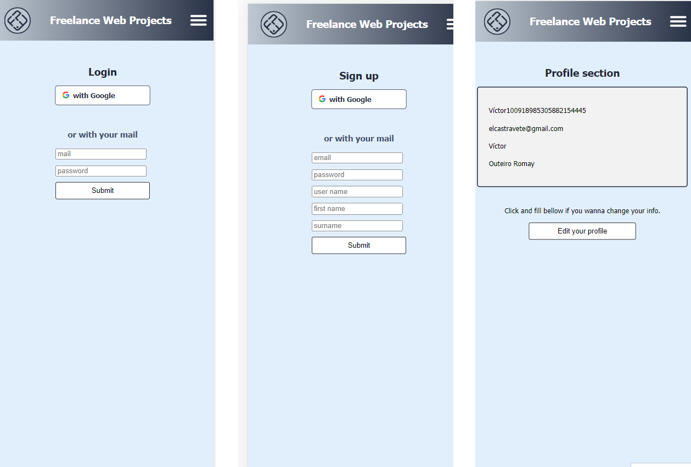
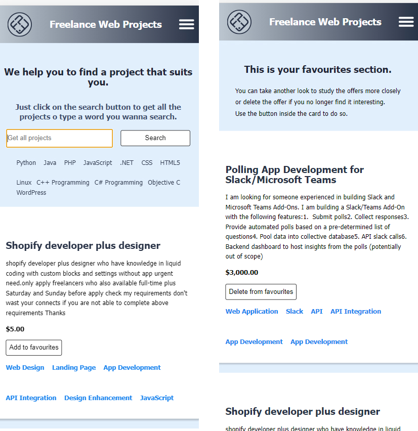
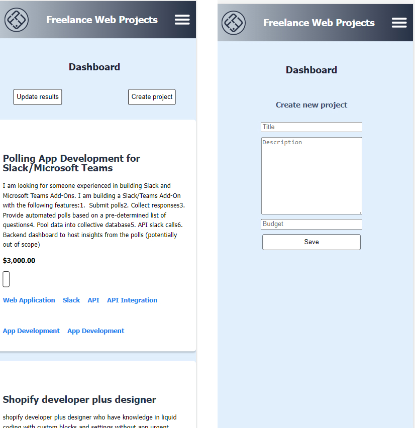

### Links

- Solution URL: [Add solution URL here](https://github.com/Radu-A/freelance-webpage-project)
- Live Site URL: [Add live site URL here](https://freelance-webpage.onrender.com/)
- Live Site URL: [Add live site URL here](./docs/index.html)

## Proceso

### Construido

- Semantic HTML5 markup
- CSS custom properties
- Flexbox
- Mobile-first workflow
- Javascript
- Node
- Express
- Mongoose
- Postgres: PgAdmin - Render
- MongoDB: Compass - Atlas

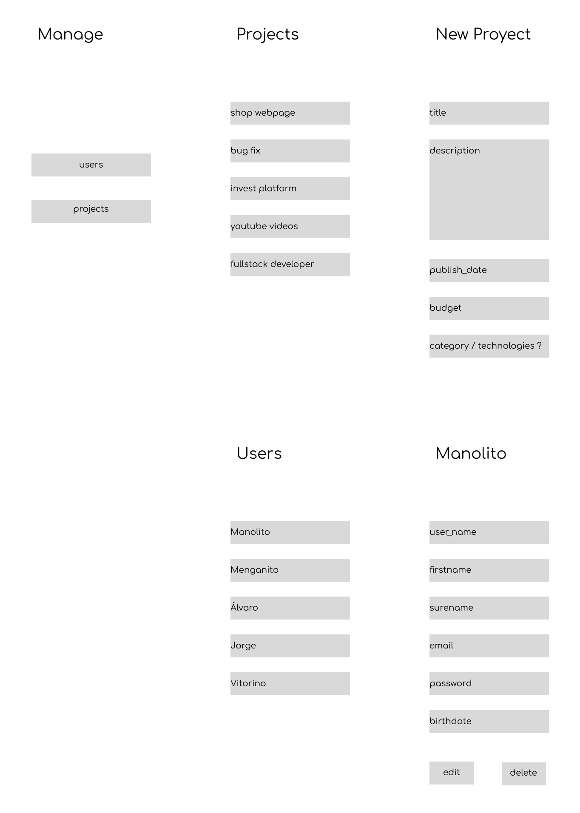
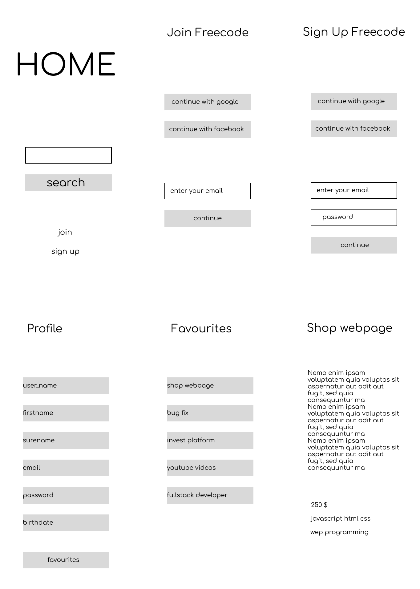 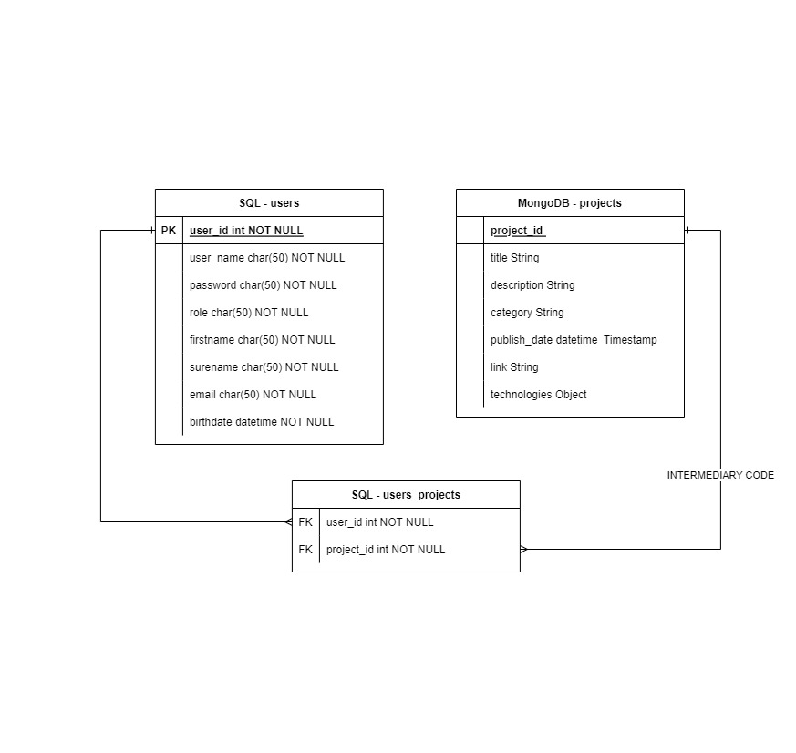

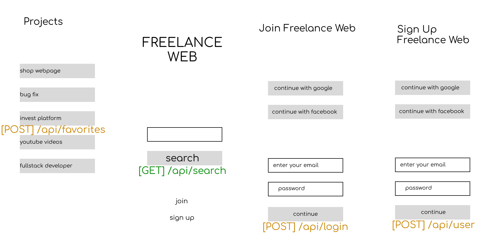
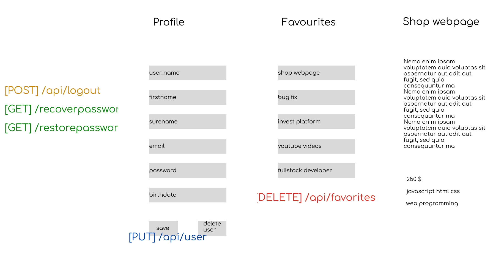
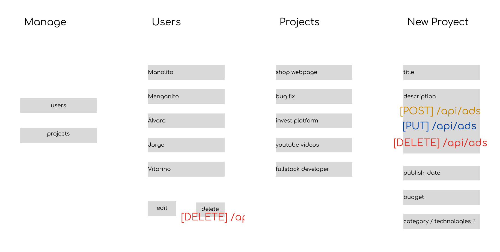

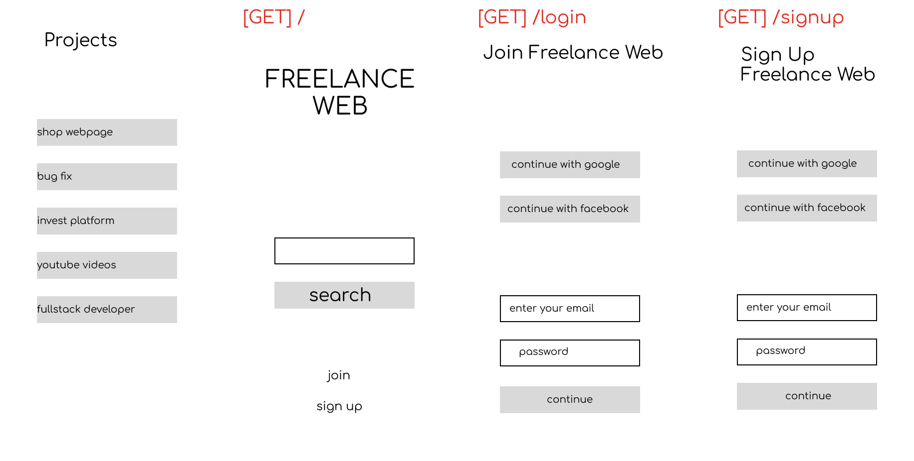
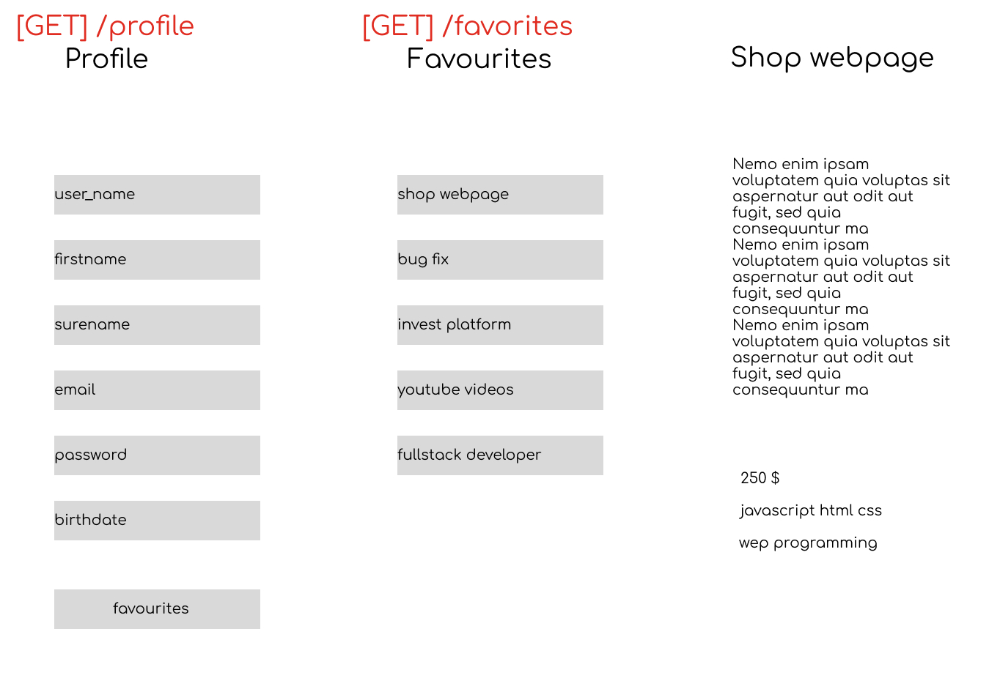
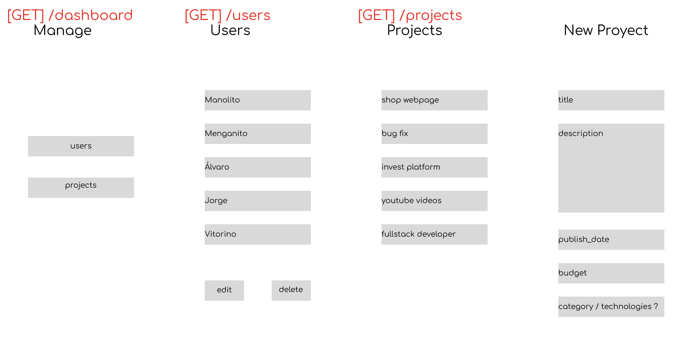

### Aprendido

Hemos aumentado nuestra experiencia en muchos campos, entre ellos:
- Gestionar proyectos de envergadura media.
- Trabajo en Grupo.
- Priorización de tareas.
- Uso de Git.
- Uso de Trello.
- Conexión de elementos de la base de datos
- Express
- Scrapping
- Autenthicacion
- JsDocs
- Recuperación de Contraseñas
